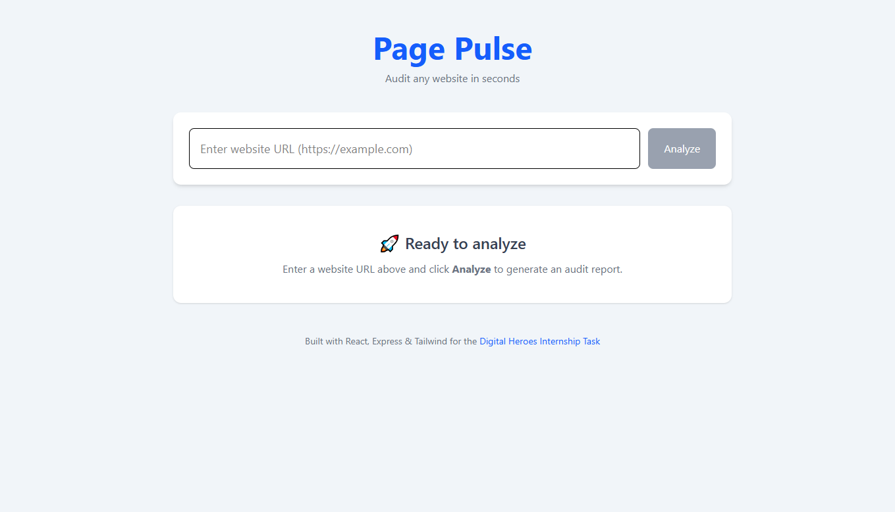
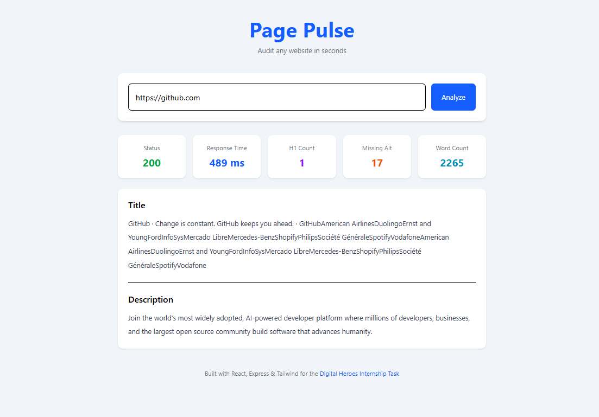
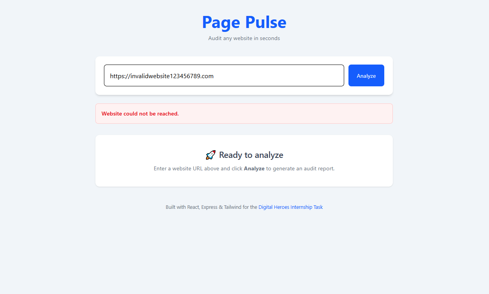

# 🚀 Page Pulse


**Page Pulse** is a modern full-stack website auditing tool built for the **Digital Heroes Internship Task**. It analyzes public webpages and provides essential SEO and content insights such as HTTP status, response time, page title, meta description, H1 count, missing ALT attributes, and approximate word count.

## 🌐 Live Demo

- **Frontend (Vercel):** <https://page-pulse-inky-eight.vercel.app/>
- **Backend API (Render):** <https://page-pulse-v5sh.onrender.com>


Below are a few screenshots of the application running in production.

## 📸 Screenshots

<h3>🏠 Home Page</h3>

<p align="center">
  
</p>

<h3>📊 Audit Result</h3>

<p align="center">
  
</p>

<h3>⚠️ Error Handling</h3>

<p align="center">
  
</p>

---

## ✨ Features

- 🌍 Analyze any public website
- 📡 HTTP Status Code
- ⚡ Response Time
- 📝 Page Title
- 📄 Meta Description
- 🔠 H1 Count
- 🖼️ Missing ALT Attributes Count
- 📚 Approximate Word Count
- 🚫 Handles invalid URLs gracefully
- ⏱️ Handles request timeouts
- 📄 Detects non-HTML pages
- 💻 Responsive user interface
- 🎨 Clean and modern UI with Tailwind CSS

---

## 🛠️ Tech Stack

### Frontend
- React
- Vite
- Tailwind CSS
- Axios

### Backend
- Node.js
- Express.js
- Axios
- Cheerio
- Jest

---

## 📁 Project Structure

```text
page-pulse/
├── backend/
├── frontend/
├── home.png
├── result.png
├── error.png
├── LICENSE
├── README.md
└── .gitignore
```

---

## 🚀 Installation

Run the backend first, then start the frontend in a separate terminal.

### Clone the repository

```bash
git clone https://github.com/MrBengaliHacker/page-pulse.git
cd page-pulse
```

### Backend

```bash
cd backend
npm install
npm start
```

The backend runs at:

```text
http://localhost:3000
```

### Frontend

Open a new terminal.

```bash
cd frontend
npm install
npm run dev
```

The frontend runs at:

```text
http://localhost:5173
```

---

## 🧪 Running Tests

Navigate to the backend directory and run:

```bash
cd backend
npm test
```

Current test coverage includes:

- ✅ Valid website audit
- ✅ Invalid URL handling
- ✅ Non-HTML page handling

---

## 📌 API

### Endpoint

```http
POST /api/audit
```

### Production URL

```text
https://page-pulse-v5sh.onrender.com/api/audit
```

### Request Body

```json
{
  "url": "https://github.com"
}
```

### Sample Response

```json
{
  "status": 200,
  "responseTime": "84 ms",
  "title": "GitHub · Build and ship software on a single, collaborative platform",
  "description": "GitHub is where developers build, ship, and maintain software.",
  "h1Count": 1,
  "missingAltCount": 17,
  "wordCount": 2265
}
```

---

## ⚠️ Error Handling

The API returns meaningful error messages for common situations:

- Invalid URL
- Website could not be reached
- Request timed out
- Only HTML pages are supported
- Website responded with an HTTP error (e.g. 403, 404)


---

## 👨‍💻 Author

**Ritam Mondal**

- GitHub: [MrBengaliHacker](https://github.com/MrBengaliHacker)

---

## 🙏 Acknowledgements

This project was built as part of the **Digital Heroes Internship Task** to demonstrate full-stack web development skills using React, Express, Axios, and Cheerio.

---

⭐ If you found this project useful, consider giving the repository a star.